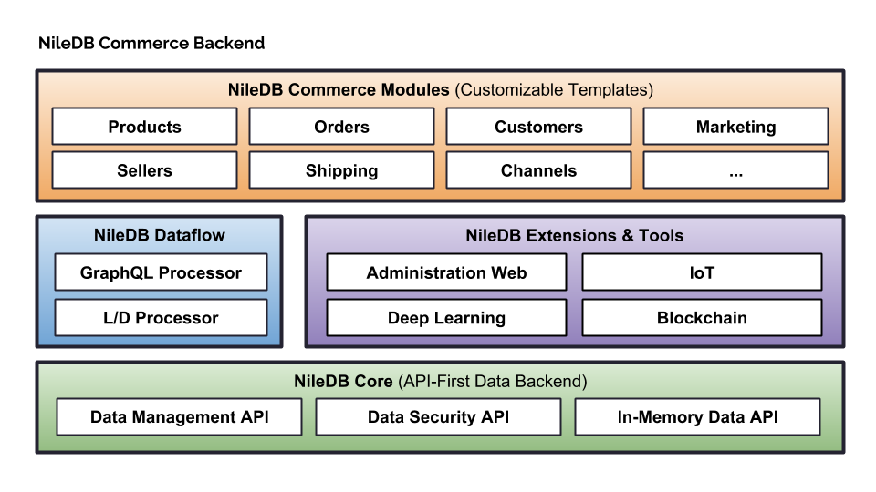

# NileDB Commerce Backend

Welcome to [NileDB](https://niledb.com) Commerce Backend, an open-source, fully customizable Commerce Platform.

### Data Model

### Quick Start

TO-DO

### Build

TO-DO

### Run

TO-DO

### Code of Conduct

Please note that this project is released with a [Contributor Code of Conduct](CODE_OF_CONDUCT.md).
By contributing to this project (commenting or opening PR/Issues etc) you are agreeing to follow this conduct, so please
take the time to read it. 

### Acknowledgments

### License

NileDB Commerce Backend is licensed under the GNU General Public License v3.0. See [LICENSE](LICENSE.txt) for details.

Copyright (c) 2018, NileDB, Inc.

[NileDB Core License](LICENSE.txt)
